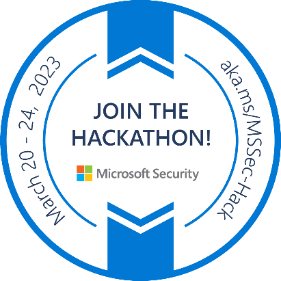

# MultiCloudXplorer
Audit Knowledgebase for Defenders

## Problem Statement:
There are significant challenges defenders must face while working with different cloud data sources, varying schemas due to lack of standardization and event normalization. Each cloud provider has its own set of services and APIs, with different data structures and schemas that can vary significantly between providers. This can make it difficult to monitor and detect security threats consistently across multiple cloud providers. Event normalization frameworks solve the problem partially at events level but there are other components in the event providing useful context e.g. privileged users, roles, authentication methods do not fall under the scope of normalization. Additionally, the vast amount of documentation available can make it difficult for defenders to identify the information quickly and efficiently they need to effectively monitor and investigate potential security threats. Other solutions such as Large Language models (LLM) are not meant to provide truthful answers on data sources, schemas, and related context across cloud providers so there is a need for structured knowledgebase answering the questions on events , data sources and other data components associated with security logs.  By collecting and organizing this information in a structured format, defenders can more easily find the information they need and quickly identify potential threats across multiple cloud providers. This can help to speed up threat hunting and investigation, allowing defenders to more effectively identify and respond to security threats in a timely manner.  

## Use cases: 
- Practical knowledgebase to learn and defend multi cloud architectures. 
- Accelerate the development of multi cloud detections using common elements across data sources.
- Completeness and telemetry gap analysis across cloud providers. 
- Provide context and relationship on various data components available within the log event useful for detection and hunting.
- Expand existing ASIM coverage on multi cloud data sources.
- Assist writing efficient KQL queries using knowledgebase on fields and values. 

## List of Cloud Activities to Track and map to MITRE ATT&CK:
- Failed Logon to Cloud Service
- Successful Logon to Cloud Service
- Cloud IAM - User Changes
- Cloud IAM - Group Changes
- Cloud IAM - Role Changes
- Cloud IAM - Policy Changes
- Cloud Infrastructure Changes
- Cloud Infrastructure Scanning and Enumeration
- Cloud Storage Access
- Cloud Data Export
- Cloud Vault Access
- Cloud Logging Stopped or Deletion
- Cloud Network Activities

## Existing Frameworks

- [OSSEM DM](https://github.com/OTRF/OSSEM)
- [MITRE ATT&CK Data Sources ](https://attack.mitre.org/datasources/)
- [Normalization and the Advanced Security Information Model (ASIM)](https://learn.microsoft.com/en-us/azure/sentinel/normalization)

## References
- [Microsoft Sentinel Github](https://github.com/Azure/Azure-Sentinel)
- Azure, AWS, Google Cloud Vendor Documentations and Blogs
- [Security Logging in Cloud Environments-GCP](https://blog.marcolancini.it/2021/blog-security-logging-cloud-environments-gcp/)
- [mind map for AWS investigation](https://expel.com/blog/mind-map-for-aws-investigations/)
- [GCP mind map for investigation and incidents by Expel](https://expel.com/wp-content/uploads/2022/08/Expel-GCP-mind-map-kit-080422.pdf)